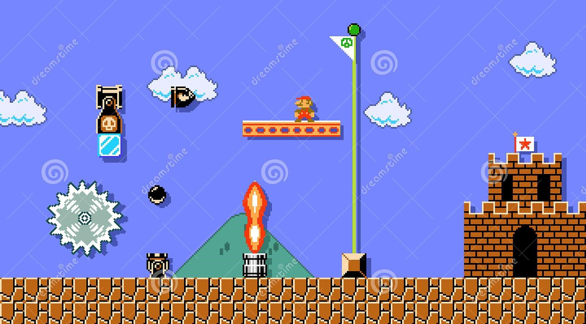

\clearpage
```{r setup, include=FALSE}
knitr::opts_chunk$set(echo = TRUE)
```
\newpage
# Description of Cotent

## Overview
The current games in the market have a lot of elements and detailed graphics, allowing the user to immerse in the virtual environment. However, most of these games contain a lot of different mechanics, like different skill combinations, tactics and characters. These games often takes hundreds of hours of playing and reading to learn and master these games. Hence, I have used the classic game Super Mario Bros as a inspiration and created a platform game which only has the necessary mechanics to minimize the learning curve of this game.  

It is a platform game with similar layout as the Super Mario Bros. Super Mario Bros is a platform game developed by Nintendo first released in 1985. The player control Mario as they travel the Mushroom Kingdom to rescue Princess Toadstool.  
Similarly, in this game, the player will control a character. The objective is to pass through a series of obstacles and enemies to reach the final destination to pull down the flag for the completion of the level.  

It will have 2 levels with different map and layout. The map will be predetermined and imported locally. There will be a death count counting the number of death the player has in that level.

## Nature of the problem
The well-known classic, Super Mario Bros was created more than 30 years ago. It is no-longer compatible with modern machines and the visual quality of the game is poor in current standard. It will inherit a similar idea of horizontal platform game.  

The number of enemies in this game are reduced but a large variety of traps are introduced to increase dynamic of the game.

## End User
The users of the game are a group of teenage students ranging from the age of 16 to 25. These user have shorter attention span. This game is straight-forward and the times needed of each level is relatively short, which suits the short attention span and busy life of the current adolescents. Although the basic idea and concept of the platform game is similar to the original Super Mario Bros, it has a different play style as the player need to focus on different traps instead of different enemies. This can give a new taste of a similar game to users that has tried the Super Mario series.  

\newpage

## Research on existing system
### Super Mario Bros
It is a platform game. The character Mario is controlled by the player, who has to go through Mushroom Kingdom. In each level, there are coins throughout the map that can be collected. There are also special gear that Mario can be collected which will then give him special powers like, invincible, shoot fireballs, etc. There are different enemies, including Goombas, who can be stepped on to defeat; Koopas, who are turtle-like creatures that can be bounced around; Browser, the boss of the game.  



\newpage

### Syobon Action (Cat Mario)
It a parody of Super Mario Bros created in 2007. The player controlling a cat must travel through a series of traps. The player has to memories the traps and dodge accordingly.  


### Game analysis
Both of the games has very basic graphics with little to none animations. It shows that the quality of animation or graphics is not necessary as long as the game mechanics are fun to play with. Both of the games moves the camera when the character leaves a certain boundary of the screen. In both games, the player can only increase or decrease the speed of the character instead of directly changing the speed of the character. Although it is more realistic to do it this way, player will have much harder time pick it up. Both of the game has a lives system which the player can see how many lives they have left.  Both game has a single jump system where double jumps are not allowed.  

While Super Mario Bros has shorter levels, Syobon Action has longer levels with a checkpoint system where the player can respawn in the checkpoint after they died.  

While Super Mario Bros is proven to be interesting to play, it has been out for so long that everyone already got used to the play style. On the other hand, while Syobon Action has much more mechanics involve and much more features, the game is too difficult that it became frustrated to play.

\newpage

## My Approach
I will use Python Module Pygame as the main framework for my game. It is a set of Python Module that is designed for making video games in Python. I will use it to design the game and user interface. I will mixed up existing tile maps for the game. I aimed to design a game that is easy to pick up but fun and challenging to play. The game mechanics will be as simple as possible with only moving horizontally, jumping and shooting horizontally. I will introduce some new enemies and traps. The game will contain long levels with checkpoints for the player to respawn.  

The game will not have a lives system where the player must start again after they died for a certain amount of times. Instead, it will have a death system where the game will only record the number of deaths the players has but will not force a restart after certain amount of death.  

The game has a user interface where the player can access the control menu and all the levels within it.  

## Alternative Methods
Other software and programming language can used to create this game as well. We can use C++ or C# for development through Unreal Engine, Unity etc; Java on jMonkeyEngine; JavaScript on PixiJS or Phaser.  

However, after compare many of the options, Python and Pygame is the most suitable among all. Although it is significantly slower than the other options, it is more straight-forward and simple for a student to start with. Moreover, the game is very simple, the slowness of Python and Pygame will have limited effect. On the other hand, Python and Pygame are much easier to pick up and require less development experience.  

Hence, Python and Pygame are chosen as the tools for this project.  

## Solution.